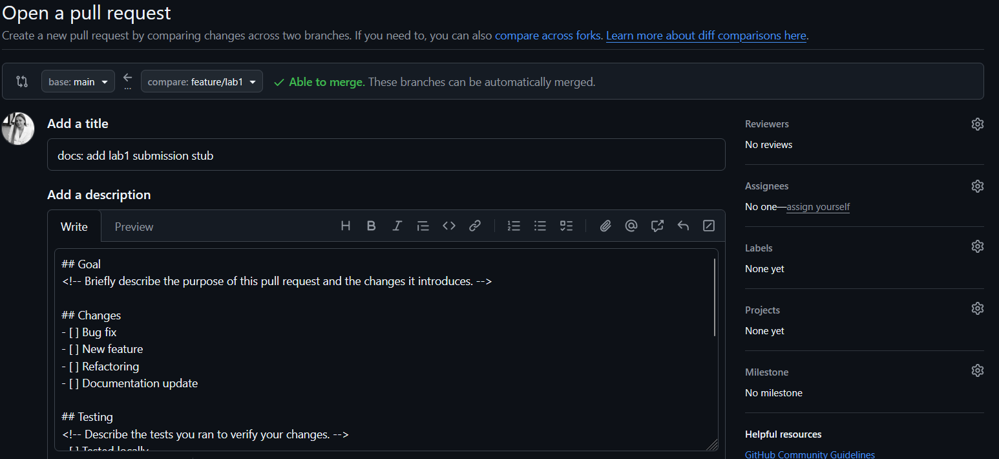

1. Signing commits allows others to confidently trust that changes come from a verified source, as GitHub marks them with a "Verified" status. It provides persistent cryptographic verification of a commit's origin within the repository's network.
2. I've lost the logs of setuping the ssh key, but I wouldn't be able to clone the repository without it. Here's the logs of verified commit:
 [main f2ef5b1] docs: add commit signing summary
 1 file changed, 2 insertions(+)
 create mode 100644 labs/submission1.md
3. Commit signing is important in DevOps workflows because it cryptographically verifies the identity of the author, ensuring the integrity and authenticity of code changes. This creates a trusted audit trail and is often required for security compliance and secure deployments.
4. https://github.com/fleeshka/DevOps-Intro/commit/f2ef5b1daca3b8f106c8663865a702291915d550 "This commit was signed with the committer's verified signature. fleeshka SSH Key Fingerprint: epWa0oYt9UaQ5sHNWrIdXl0Vvaz6tQMrpp2dhwg7KUQ Verified on Feb 6, 2026, 05:38 PM"

1. 
2. it was added in the commit before creating a submission PR: https://github.com/fleeshka/DevOps-Intro/commit/9a01abcd8d3ec399cb0db5d38fce30408b719608
3. PR templates standardize the information required for review, ensuring contributors clearly communicate the goal, changes, and testing done for every change. This structured format streamlines the review process and improves collaboration by reducing back-and-forth questions and maintaining project consistency.
4. I didn't quite get the steps right so I could miscommit a few times. Also, a part of this submission1.md already exists in the main branch because it consists of the steps made before touching the PR section.